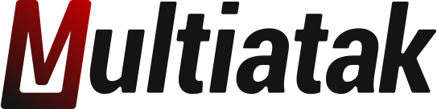

<p align="center">

</p>

<p align="center">A E-Commerce homepage for Multiatak company</p>
<p align="center">You can see the application running here: <a href="https://multiatak.vercel.app">Multiatak</a>.</p>

<p align="center">
 
  
</p>

## Desktop preview 🖥️

<br/>


<br/>

## Mobile preview 📱

<br/>


<br/>

## Techs and Libs 🧪

This project was developed with the following technologies and libraries:

- [React](https://reactjs.org)
- [Styled Components](https://styled-components.com/)
- [Material UI](https://mui.com/pt/)
- [React Elastic Carousel](https://sag1v.github.io/react-elastic-carousel/)
- [React Icons](https://react-icons.github.io/react-icons/)

## Project 💻

This is a project that is one of the hiring stages for a Front-end position at [Eva Commerce](https://evacommerce.com.br/).
The purpose is to create a responsive website following a ready-made layout, using HTML, CSS and technologies of my choice.

## Layout 💅

The layouts design are available in these files:

- [Desktop](./.github/desktop-layout.psd)
- [Mobile](./.github/mobile-layout.psd)

## Running it 🚀

Clone the project and access its folder.

```bash
$ git clone https://github.com/divinurised/multiatak
$ cd multiatak
```

To start it, follow the steps below:

```bash
# Install dependencies
$ yarn
# Start the project
$ yarn start
```

Or

```bash
# Install dependencies
$ npm install
# Start the project
$ npm start
```

The app will be available in your browser at the url http://localhost:3000.

## License

[MIT License](./LICENSE.md)

---

Made with ⭐ by Davi Alcântara.
